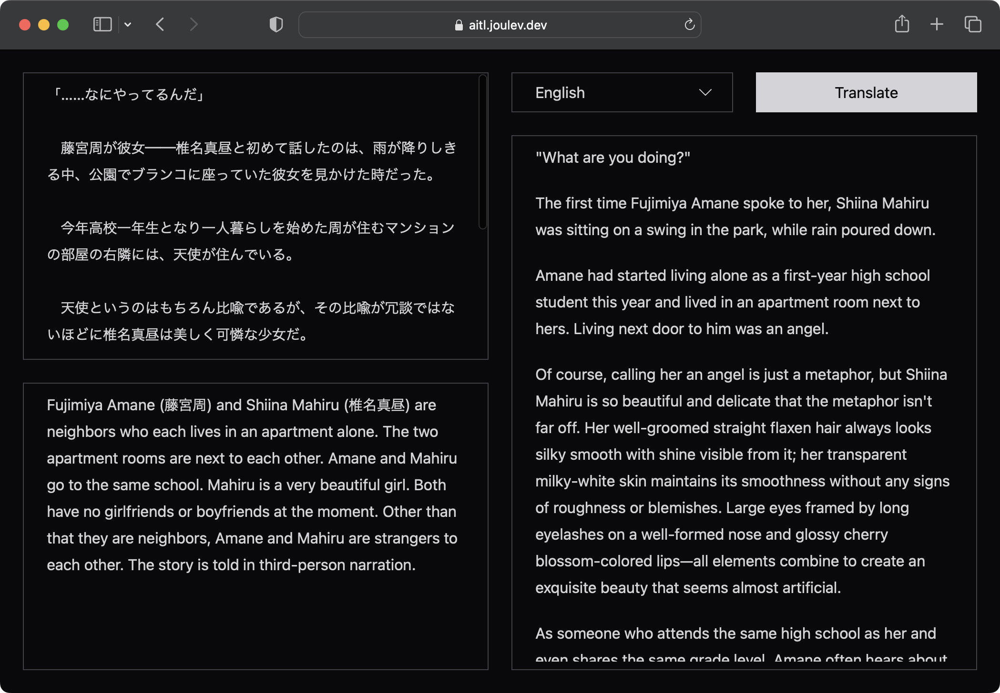

# translate

This is my first somewhat serious attempt of prompt engineering, which is an app that can be used to translate light novels.

Although we don't provide any examples for the model to understand ([zero-shot prompting](https://www.promptingguide.ai/techniques/zeroshot)), it can still do pretty well actually.

Example translation of "The Angel Next Door Spoils Me Rotten"

### Original text

The very first lines of the light novel, volume 1, in Japanese.

### Provided context

> Fujimiya Amane (藤宮周) and Shiina Mahiru (椎名真昼) are neighbors who each lives in an apartment alone. The two apartment rooms are next to each other. Amane and Mahiru go to the same school. Mahiru is a very beautiful girl. Both have no girlfriends or boyfriends at the moment. Other than that they are neighbors, Amane and Mahiru are strangers to each other. The story is told in third-person narration.

### Translated content

Original text in Japanese &copy; 佐伯さん, はねこと, SB Creative Corp. English text are completely AI translation.

> "...What are you doing?"
>
> The first time Fujimiya Amane spoke to her, Shiina Mahiru was sitting on a swing in the park, amidst pouring rain.
>
> Amane had started living alone as a first-year high school student this year, and his apartment room was right next to Mahiru's. An angel lived there.
>
> Of course, calling her an angel was just a metaphor, but Mahiru's beauty and delicacy were no joke.
>
> Her well-maintained straight ash-colored hair always looked silky smooth and shiny. Her translucent milky-white skin had a smoothness that knew no roughness or blemishes. She boasted delicate beauty with all the elements of long eyelashes framing her large eyes lined with a well-shaped nose bridge and glossy cherry-colored lips.
>
> Being in the same high school as her, and even in the same grade level, Amane often heard about Mahiru's reputation as an academically talented beauty.
>
> In fact, she always ranked first on exams and excelled in physical education classes like an ace player. Although Amane didn't know much since they were in different classes, if rumors were true then she might be close to being perfect herself.
>
> There seemed to be no visible flaws; she was beautiful both in appearance and academic performance. And yet she remained humble without arrogance or shyness—a personality that could easily make someone popular among others.
>
> With such a beautiful girl living next door, it must have been an envy-inducing situation for some boys indeed.
>
> However, Amane had no intention of getting involved with her romantically or otherwise.
>
> Of course, Mahiru appeared attractive even to him.
>
> But he simply saw himself as just neighbors—nothing more—and he had neither the opportunity nor any intention of interacting with her anyway.
> If he did get involved with her somehow, he would surely attract jealousy from other boys. Besides, if simply living next door was enough to become friends, then the boys who fell in love with her wouldn't have had any trouble either.
>
> Furthermore, it didn't necessarily mean that being attractive as a person of the opposite sex and having romantic feelings for someone would always lead to a relationship. For Amane, Mahiru was just a beautiful girl to admire from afar.
>
> So he had no expectations of developing any sweet or sour relationships and thus had no intention of getting involved or even making contact with her just because they were neighbors.
>
> Therefore, when he saw her standing alone in the rain without an umbrella looking lost, he couldn't help but give her a suspicious look as if she were some kind of intruder.
>
> Despite it being raining heavily enough for everyone else to hurry straight home without taking detours, she sat on the swing all by herself at the park located between school and their apartment building.
> (What is she doing out here in the rain?)
>
> The sky was dim due to thick gray clouds blocking sunlight since morning. The rain made visibility poor, but one could immediately recognize her with that distinctive ash-colored hair and school uniform.
>
> He couldn't understand why she wasn't using an umbrella and instead allowed herself to get wet like this.
> It didn't seem like she was waiting for anyone either; she didn't seem bothered by getting wet as she absentmindedly looked somewhere else.
> Her slightly raised face lacked color due to its naturally pale complexion—it even appeared somewhat bluish-white.
> She seemed prone to catching a cold quickly under such conditions. And yet Mahiru quietly stayed there without intending to go back inside—maybe it's something she preferred doing on her own? It might not be appropriate for others to interfere.
>
> Thinking so, Amane scratched his head while trying to slip past beside the park—then suddenly noticed that Mahiru's face looked distorted as if about to cry. He couldn't help but feel a pang of conscience.
> It's not like he wanted to get involved with her or anything; it was simply that leaving someone with such a face alone made him feel somewhat guilty, nothing more.
>
> "...What are you doing?"
>
> He tried to sound as nonchalant as possible, meaning no ill intentions. Mahiru shook her long hair that seemed heavy with moisture and turned towards him.
> Her beautiful face remained unchanged.
>
> Even though she was wet from the rain, her radiance didn't diminish at all. If anything, the rain became a prop that highlighted her face even more—she truly was an attractive woman who could make water drip off her.
>
> Her double eyelids opened wide as she looked at him.
>
> At least Mahiru recognized Amane as her neighbor. They occasionally passed each other in the morning after all.
> However, being suddenly spoken to by someone she had never interacted with before and having contact initiated by a complete stranger caused a slight hint of caution to appear in her caramel-colored eyes.
>
> "Mr. Fujimiya... Do you need something from me?"
>
> Ah, so she remembered his last name—a strange feeling washed over him—but at the same time, he sensed that this would probably only reinforce her wariness rather than ease it.
> Certainly, if someone were approached by another person they barely knew—even if not entirely unfamiliar—it made sense for them to be on guard.
>
> Perhaps she just didn't want much involvement with people of the opposite sex either? It seemed like boys from both upper and lower grades at school often confessed their feelings or approached Mahiru; maybe Amane came across as having ulterior motives too?

The translation to Vietnamese of the same text is good as well. Definitely not "production-grade" translations and a professional translator is still needed to edit and improve certain parts, but with a good "context" provided (so that the AI can understand the story until that point), the translation can be understood well.

At least the translation is better than Google Translate 🙄 and at least if I buy raw Japanese light novels now, I can be reasonably sure I can understand _at least most of them_ using this translator.

## Try it

### Deployed app

You can try at https://aitl.joulev.dev. Do note that certain limitations have been placed there, such as token limit and rate limit, a long text such as the example provided above isn't allowed, but at least you can still try smaller samples.

### Deploy it yourself

The token limit is lifted.

1. Create an OpenAI account and get an OpenAI API key. That will be the `OPENAI_API_KEY` environment variable.
2. If you need rate limiting, create a Redis database on [Upstash](https://upstash.com/) and get the `UPSTASH_REDIS_REST_URL` and `UPSTASH_REDIS_REST_TOKEN` environment variables. Otherwise delete `middleware.ts`.
3. Deploy the project like a normal Next.js project.
